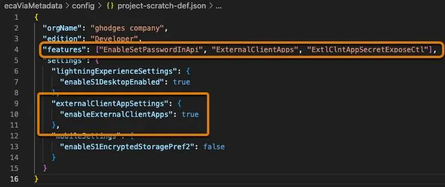
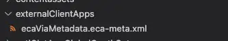
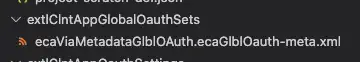
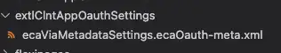
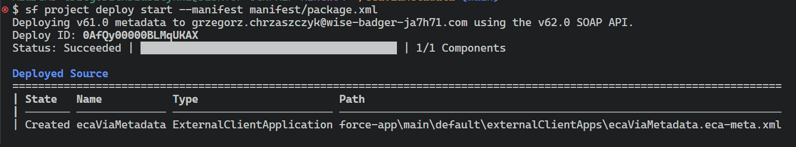
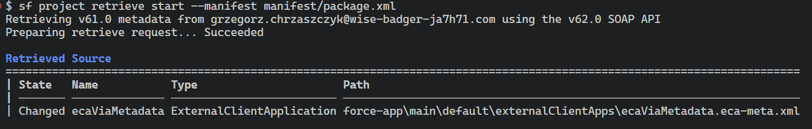
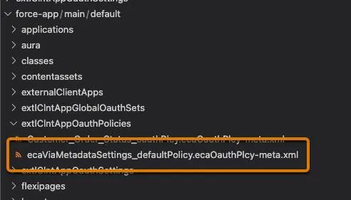

# Salesforce DX Project - External Client App

## Create an SFDX Project

`sf project generate --name ecaViaMetadata --template standard`

## Authorize Your Dev Hub Org

`sf org login web --set-default-dev-hub --alias ecaViaMetadata --instance-url https://<my domain>`


## Configure the SFDX Project for an External Client App

### Scratch org definition file



#### Features

```json
 "features": ["EnableSetPasswordInApi", "ExternalClientApps", "ExtlClntAppSecretExposeCtl"],
```

#### Settings

```json
    "externalClientAppSettings": {
      "enableExternalClientApps": true
    }
```

#### package.xml manifest file

```xml
<?xml version="1.0" encoding="UTF-8"?>
<Package xmlns="http://soap.sforce.com/2006/04/metadata">
    <types>
        <members>*</members>
        <name>ExternalClientApplication</name>
    </types>
    <types>
        <members>*</members>
        <name>ExtlClntAppOauthSettings</name>
    </types>
    <types>
        <members>*</members>
        <name>ExtlClntAppGlobalOauthSettings</name>
    </types>
    <types>
        <members>*</members>
        <name>ExtlClntAppOauthConfigurablePolicies</name>
    </types>
    <version>61.0</version>
</Package>
```

#### Folders/files

- `externalClientApps/ecaViaMetadata.eca-meta.xml`

    

    ```xml
    <?xml version="1.0" encoding="UTF-8"?>
    <ExternalClientApplication xmlns="http://soap.sforce.com/2006/04/metadata">
        <contactEmail>eca_metadata@example.com</contactEmail>
        <description>External client app Metadata API creation</description>
        <distributionState>Local</distributionState>
        <isProtected>false</isProtected>
        <label>ecaViaMetadata</label>
    </ExternalClientApplication>
    ```

---

### At this point your external client app is technically complete. You could deploy this configuration, and it would show up in the External Client App Manager as a basic external client app

However, to make a useful app, you need a plugin - `OAuth plugin`

---

## Enable and Configure the OAuth Plugin

**ECA** (external client apps) include two settings files and a policies file.

The Global OAuth Settings file includes those sensitive fields like OAuth consumer key and consumer secret that should be protected.
The OAuth Settings file includes all of the less-sensitive configurations for an external client app.
There is no need to create a policies file while configuring an external client app for the web server flow, because policies are configured based on the settings files. The OAuth Policies file is generated when you deploy the external client app.

###

### Folder/files

- Global OAuth Settings File : `extlClntAppGlobalOauthSets/ecaViaMetadataGlblOAuth.ecaGlblOauth-meta.xml`

    

    ```xml
    <?xml version="1.0" encoding="UTF-8"?>
    <ExtlClntAppGlobalOauthSettings xmlns="http://soap.sforce.com/2006/04/metadata">
        <callbackUrl>https://openidconnect.herokuapp.com/callback</callbackUrl>
        <externalClientApplication>ecaViaMetadata</externalClientApplication>
        <isConsumerSecretOptional>false</isConsumerSecretOptional>
        <isIntrospectAllTokens>false</isIntrospectAllTokens>
        <isPkceRequired>false</isPkceRequired>
        <isSecretRequiredForRefreshToken>true</isSecretRequiredForRefreshToken>
        <label>ecaViaMetadataglobalset</label>
        <shouldRotateConsumerKey>false</shouldRotateConsumerKey>
        <shouldRotateConsumerSecret>false</shouldRotateConsumerSecret>
    </ExtlClntAppGlobalOauthSettings>
    ```

- Create an OAuth Settings File `extlClntAppOauthSettings/ecaViaMetadataSettings.ecaOauth-meta.xml`

    

    ```xml
    <?xml version="1.0" encoding="UTF-8"?>
    <ExtlClntAppOauthSettings xmlns="http://soap.sforce.com/2006/04/metadata">
        <commaSeparatedOauthScopes>Api, Web, OpenID</commaSeparatedOauthScopes>
        <externalClientApplication>ecaViaMetadata</externalClientApplication>
        <label>ECA via Metadata Oauth Settings</label>
    </ExtlClntAppOauthSettings>
    ```

## Deploy External Client App

1. Run this command to deploy the external client app. Replace `username` with the username you used to log in when you authorized the Dev Hub

    `sf project deploy start --manifest manifest/package.xml --target-org <Username>`

    


2. Retrieve the external client app from your Trailhead Playground. Replace `username` with the username you used to log in when you authorized the Dev Hub.

    `sf project retrieve start --manifest manifest/package.xml --target-org <username>`

    

3. Verify Your App
    
    After successfully deploying and retrieving the external client app, you should see a policies file in your SFDX project where there wasn’t one before.

    

    Open the External Client App Manager and see a new external client app called ecaViaMetadata

### Trailhead
[ECA](https://trailhead.salesforce.com/content/learn/projects/create-an-external-client-app-using-metadata-api/create-an-external-client-app)